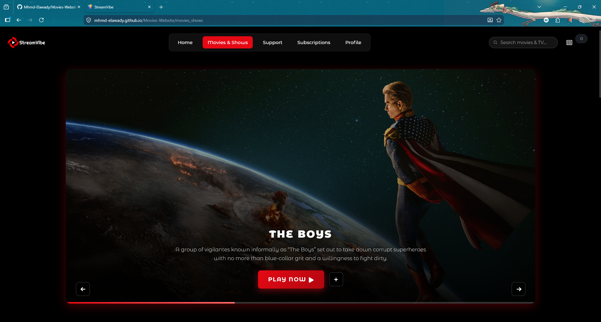
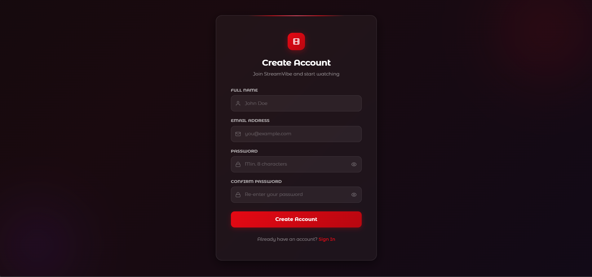
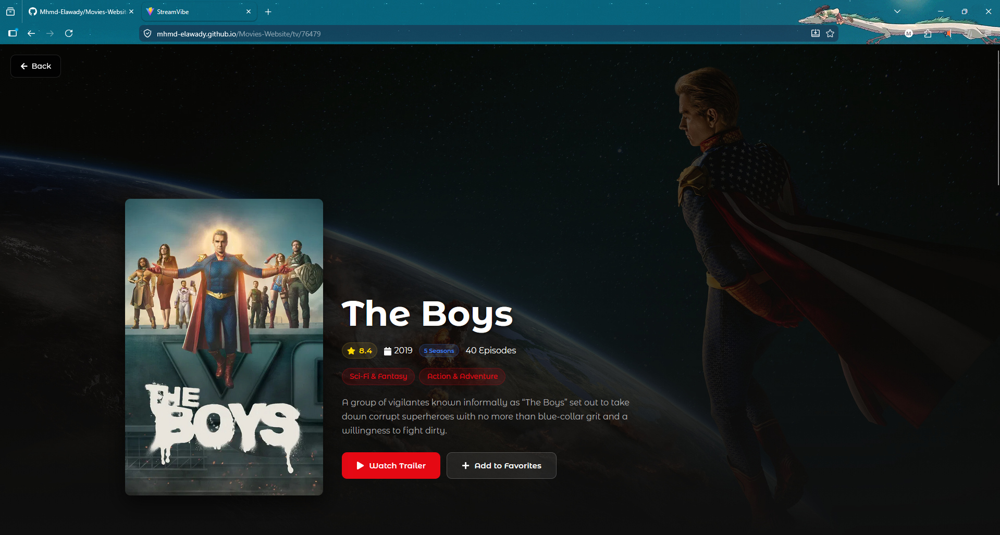

# 🎬 StreamVibe

Welcome to **StreamVibe**, a modern, high-performance, and responsive movie application built with React and Vite. Enjoy a seamless experience as you browse through movies and TV shows!

---

## ✨ Features

- **User Authentication:** Secure registration and login flow using Supabase.
- **Protected Routes:** Ensures privacy by restricting main app access to authenticated users only.
- **Form Validation:** Immediate, user-friendly feedback on registration and login forms using Formik and Yup.
- **Search & Discover:** Easily browse, search, and explore detailed recommendations for different movies and TV shows.
- **Responsive Design:** A beautifully styled dark-themed UI that works perfectly on desktops, tablets, and phones.
- **State Management:** Efficient client-side and application state management utilizing Redux Toolkit.

---

## 🛠️ Technologies Used

- **Frontend Framework:** React 19 ⚛️
- **Build Tool:** Vite ⚡
- **Authentication & Backend:** Supabase 🛡️
- **State Management:** Redux Toolkit 📦
- **Routing:** React Router DOM 🛣️
- **HTTP Client:** Axios 🌐
- **Form Handling:** Formik & Yup 📋
- **Styling:** Bootstrap & CSS Modules / Vanilla CSS 🎨

---

## ⚙️ Installation & Setup

Follow these steps to get the project working on your local machine:

**1. Clone the repository**
```bash
git clone https://github.com/Mhmd-Elawady/Movies-Website.git
cd my-movie-app
```

**2. Install dependencies**
```bash
npm install
```

**3. Set up environment variables**
Create a `.env` file in the root of the project and add your Supabase (and any other API) keys:
```env
VITE_SUPABASE_URL=your_supabase_project_url
VITE_SUPABASE_ANON_KEY=your_supabase_anon_key
VITE_TMDB_API_KEY=your_api_key_here # If using TMDB
```

---

## 🚀 How to Run Locally

Once everything is installed and your `.env` variables are set up:

Start the development server:
```bash
npm run dev
```

The application will typically start at `http://localhost:5173`. Open this URL in your browser to view the app!

To build the project for production, run:
```bash
npm run build
```

---

## 📂 Folder Structure

A simple overview of the project directory:

```text
my-movie-app/
├── public/             # Static public assets (e.g., favicon)
├── src/
│   ├── assets/         # Optimized images (WebP), svgs, and fonts
│   ├── components/     # Reusable UI components (Navbar, MovieCards, etc.)
│   ├── hooks/          # Custom React hooks (e.g., use Recommendations)
│   ├── Routes/         # React Router setup and protected pages
│   ├── store/          # Redux toolkit store and slices
│   ├── App.jsx         # Main application root component
│   ├── main.jsx        # Entry point for React
│   └── index.css       # Global base styles
├── dist/               # Production build output folder
├── index.html          # Main HTML layout
├── package.json        # Dependencies and scripts tree
└── vite.config.js      # Vite specific configuration
```

---

## 📸 Screenshots

*(Replace the placeholder links below with actual paths to your beautiful screenshots!)*

### Home Page


### Authentication (Login / Register)


### Movie Details


---

## ⚡ Performance Optimizations

We've focused heavily on making StreamVibe blazingly fast:
- **Code Splitting & Lazy Loading:** Components and routes are loaded only when needed.
- **WebP Image Formats:** Heavy image assets have been converted and compressed for faster network delivery.
- **Tree-Shaking:** Eliminated unused packages, dependencies, and dead code.
- **CSS & Font Minimization:** Drastically reduced unnecessary footprint sizes from style bundles.
- **React Rendering Adjustments:** Leveraged component memoization and efficient state passing to prevent unnecessary re-renders.

---

## 🔮 Future Improvements

- [ ] Add User Watchlists or Favorites functionality.
- [ ] Implement a personalized user profile dashboard.
- [ ] Incorporate user reviews and movie ratings.
- [ ] Add a trailer video player directly into the movie details page.
- [ ] Create a light mode theme toggle.

---

## 👤 Author

**Mohamed Elawady**

- GitHub: [@Mhmd-Elawady](https://github.com/Mhmd-Elawady)
- *Feel free to connect or reach out regarding any queries about this project!*
